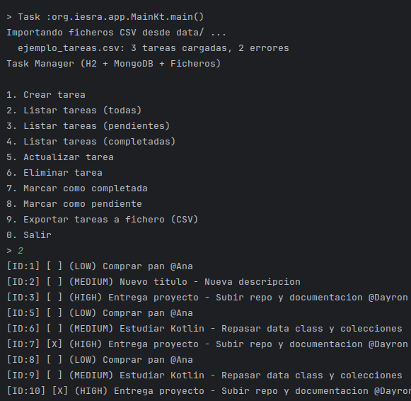
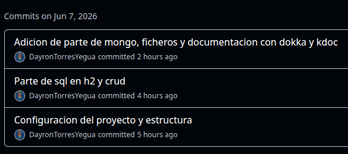

# Solución del proyecto

- **Proyecto:** Task Manager
- **Alumno/a:** Dayron Torres Yegua
- **Repositorio:** https://github.com/IES-Rafael-Alberti/2526-u8u9-9-1-proyectolibre-DayronTorresYegua

## 1. Resumen del proyecto

- **Problema que resuelve:** Centraliza la gestion de tareas
- **Usuarios principales:** Personas que necesitan organizar tareas
- **Funcionalidades principales:** CRUD de tareas, importacion de csv, registro de errores e historial en mongodb y exportacion a csv
- **Entidades principales:** 
  - `Task` (modelo), 
  - `TaskService` (lógica de negocio), 
  - `TaskRepository` (interfaz de persistencia).
- **Estructura del proyecto:** 
  - `model/` (dominio), 
  - `service/` (negocio), 
  - `repository/` (persistencia SQL/file/Mongo), 
  - `validator/` (validaciones), 
  - `exception/` (errores), 
  - `app/` (UI), 
  - `util/` (configuración)

## 2. Instalación y ejecución

```bash
# Comandos necesarios para ejecutar el proyecto
./gradlew run
```
- Tambien puedes directamente ir a app/Main.kt y ejecutarlo


- **Requisitos previos:** JDK 21, Mongodb, h2
- **Configuración necesaria:** En `AppConfig` Se configuran las varibles de h2 y de mongo
- **Datos de prueba incluidos:** `data/ejemplo_tareas.csv` Se importan automaticamente

## 3. Diseño y modelo

- **Clases principales:** 
    - `Task` -> `data class` con id, title, description, status, priority, assignee. Inmutable, con `copy()` para modificaciones.
      https://github.com/IES-Rafael-Alberti/2526-u8u9-9-1-proyectolibre-DayronTorresYegua/blob/babecb592b1bbe8ce7bb5ec7c0cbffdcd195f97d/src/main/kotlin/org/iesra/model/Task.kt#L1-L20
    - `TaskService` -> Lógica de negocio CRUD + logging. Depende de interfaces `TaskRepository` y `TaskHistoryLogger` (DIP).
      https://github.com/IES-Rafael-Alberti/2526-u8u9-9-1-proyectolibre-DayronTorresYegua/blob/babecb592b1bbe8ce7bb5ec7c0cbffdcd195f97d/src/main/kotlin/org/iesra/service/TaskService.kt#L1-L133

- **Relaciones importantes:** 
    - `TaskService` -> `TaskRepository` (interfaz) y `TaskHistoryLogger` (interfaz). `SqlTaskRepository` implementa `TaskRepository`. `MongoTaskHistoryRepository` y `NoOpTaskHistoryLogger` implementan `TaskHistoryLogger`.
- **Genéricos usados:** No hay genericos

- **Colecciones usadas:** 
    - `List<Task>` en `TaskService.listTasks()` y `SqlTaskRepository.findAll()` — inmutable. `MutableList<ProcessingError>` en `TaskFileProcessor.process()` para acumular errores dinámicamente.
  
      https://github.com/IES-Rafael-Alberti/2526-u8u9-9-1-proyectolibre-DayronTorresYegua/blob/741e541b26b2951dc01bb7728b61366fc7e4882c/src/main/kotlin/org/iesra/repository/sql/SqlTaskRepository.kt#L53-L69

- **Principios SOLID aplicados:**
  - **SRP:** `TaskValidator` solo valida, `TaskService` solo negocio, `SqlTaskRepository` solo BD.
  - **DIP:** `TaskService` depende de interfaces, no de implementaciones. 
  
- **Patrones de diseño:** 
  - **Repository:** `TaskRepository` → `SqlTaskRepository`. Desacopla persistencia de negocio. 
  
    https://github.com/IES-Rafael-Alberti/2526-u8u9-9-1-proyectolibre-DayronTorresYegua/blob/741e541b26b2951dc01bb7728b61366fc7e4882c/src/main/kotlin/org/iesra/repository/TaskRepository.kt#L1-L28
  - **DAO (Data Access Object):** `SqlTaskRepository` actúa como DAO encapsulando el acceso a la base de datos H2, separando la lógica de persistencia de la lógica de negocio.

## 4. Persistencia

### Ficheros

- **Ficheros usados:** `data/ejemplo_tareas.csv` (import), `data/export/tasks_export_*.csv` (export), `data/errors/*_errors.json` (errores).
- **Formato y contenido:** CSV con cabecera `title;description;status;priority;assignee`. JSON con estructura de errores.
- **Lectura/escritura:** `TaskFileProcessor.process()` lee con `readLines()`. `TaskFileExporter.export()` escribe con `bufferedWriter()`. 
- **Clase responsable:** 

https://github.com/IES-Rafael-Alberti/2526-u8u9-9-1-proyectolibre-DayronTorresYegua/blob/741e541b26b2951dc01bb7728b61366fc7e4882c/src/main/kotlin/org/iesra/repository/file/TaskFileProcessor.kt#L1-L118
- **Errores controlados:** Fichero inexistente -> `IllegalArgumentException`. Líneas inválidas -> se saltan y registran en MongoDB + JSON.

### MongoDB

- **Base de datos:** `task_manager`.
- **Colecciones:** `task_history` (historial CRUD), `file_processing_errors` (errores de importación).
- **Documento de ejemplo:**

```json
{
  "ts": "2026-06-04T12:10:00Z", "action": "CREATED", "taskId": 1,
  "snapshot": { 
    "id": 1, 
    "title": "Comprar pan", 
    "status": "PENDING", 
    "priority": "LOW"
  }
}
```

- **Operaciones realizadas:** Inserción con `insertOne()`. Sin consultas/actualizaciones/borrados. 
- **Clase responsable:** 

https://github.com/IES-Rafael-Alberti/2526-u8u9-9-1-proyectolibre-DayronTorresYegua/blob/741e541b26b2951dc01bb7728b61366fc7e4882c/src/main/kotlin/org/iesra/repository/mongo/MongoTaskHistoryRepository.kt#L1-L44

### Base de datos relacional

- **SGBD utilizado:** H2
- **Script SQL:** `scripts/schema.sql`.
- **Tablas y relaciones:** `assignees(id PK, name UNIQUE)`, `tasks(id PK, title, description, status, priority, assignee_id FK -> assignees)`.
- **Operaciones CRUD:** Completo (create, read, update, delete individual, delete all). 

  https://github.com/IES-Rafael-Alberti/2526-u8u9-9-1-proyectolibre-DayronTorresYegua/blob/741e541b26b2951dc01bb7728b61366fc7e4882c/src/main/kotlin/org/iesra/repository/sql/SqlTaskRepository.kt#L1-L140
- **Consultas parametrizadas:** Todas con `PreparedStatement`. 

   https://github.com/IES-Rafael-Alberti/2526-u8u9-9-1-proyectolibre-DayronTorresYegua/blob/741e541b26b2951dc01bb7728b61366fc7e4882c/src/main/kotlin/org/iesra/validator/TaskValidator.kt#L10-L11
- **Gestión de conexión y cierre:** Cada operación abre/cierra con `connectionProvider().use { conn -> ... }`.

## 5. Validaciones y errores

- **Expresiones regulares:** 
  - Título: `^[\\p{L}0-9][\\p{L}0-9 _\\-]{1,98}[\\p{L}0-9]$`. Válido: `"Estudiar Kotlin"`. No válido: `" A"`.
  - Asignee: `^[\\p{L}][\\p{L} '.\\-]{1,58}[\\p{L}]$`. Válido: `"Ana María"`. No válido: `""`.
  
    https://github.com/IES-Rafael-Alberti/2526-u8u9-9-1-proyectolibre-DayronTorresYegua/blob/main/src/main/kotlin/org/iesra/validator/TaskValidator.kt#L10-L11
- **Excepciones controladas:** MongoDB no disponible -> warning con Logback (no interrumpe). CSV inválido -> se salta la línea. Cierre automático con `use`.
- **Excepciones propias:** `NotFoundException` (tarea no encontrada), `ValidationException` (datos inválidos). Capturadas en `ConsoleUi.safeUi()`.

## 6. Pruebas y evidencias

- **Pruebas realizadas:** 

    Importación CSV automática con resumen por consola y JSON de errores generado para comprobar con datos que funciona bien la aplicacion


- **Datos de prueba:**

  https://github.com/IES-Rafael-Alberti/2526-u8u9-9-1-proyectolibre-DayronTorresYegua/blob/babecb592b1bbe8ce7bb5ec7c0cbffdcd195f97d/data/ejemplo_tareas.csv#L1-L6
- **Evidencia de ejecución:**



- **Evidencia de ficheros:** `data/errors/ejemplo_tareas_errors.json` con errores de líneas inválidas.

  https://github.com/IES-Rafael-Alberti/2526-u8u9-9-1-proyectolibre-DayronTorresYegua/blob/babecb592b1bbe8ce7bb5ec7c0cbffdcd195f97d/data/errors/ejemplo_tareas_errors.json#L1-L15
- **Evidencia de MongoDB:** Cada operación CRUD inserta en `task_history`. Cada error de importación se registra en `file_processing_errors`.
- **Evidencia de SQL:** Esquema H2 se crea automáticamente, CRUD persiste en `data/task_manager.mv.db`.

  https://github.com/IES-Rafael-Alberti/2526-u8u9-9-1-proyectolibre-DayronTorresYegua/blob/babecb592b1bbe8ce7bb5ec7c0cbffdcd195f97d/src/main/kotlin/org/iesra/repository/sql/SqlTaskRepository.kt#L1-L140

  https://github.com/IES-Rafael-Alberti/2526-u8u9-9-1-proyectolibre-DayronTorresYegua/blob/babecb592b1bbe8ce7bb5ec7c0cbffdcd195f97d/src/main/kotlin/org/iesra/repository/sql/Schema.kt#L1-L29
## 7. Refactorización, documentación y Git

- **Refactorizaciones aplicadas:** Pasar de uso de println para comprobar cosas a logs
- **Código limpio:** Nombres descriptivos, SRP, uso de `use` para recursos, sin duplicidad.
- **Documentación:** Uso de kdoc para generar documentacion con dokka
- **Control de versiones:** Commits realizados, falta el commits de las respuestas a este archivo


## 8. Problemas encontrados y soluciones

| Problema | Solución aplicada | Enlace o evidencia |
|----------|-------------------|--------------------|
| Línea malformada detenía toda la importación | Procesar línea por línea con try/catch | https://github.com/IES-Rafael-Alberti/2526-u8u9-9-1-proyectolibre-DayronTorresYegua/blob/main/src/main/kotlin/org/iesra/repository/file/TaskFileProcessor.kt#L38-L64 |
| MongoDB sin conexión lanzaba excepción | Capturar y loguear con Logback (warning) | https://github.com/IES-Rafael-Alberti/2526-u8u9-9-1-proyectolibre-DayronTorresYegua/blob/main/src/main/kotlin/org/iesra/repository/mongo/MongoTaskHistoryRepository.kt#L36-L41 |


## 9. Respuestas a los criterios de evaluación

Completa cada criterio con una respuesta breve (Por ejemplo, si habla de clases puedes listar las mas importantes, y entrar en detalle en alguna), técnica y con enlaces al código.

### 9.1. Diseño general

Gestor de tareas en consola. Entidades: `Task`, `TaskService`, `TaskRepository`. Funcionalidades: CRUD, filtrado, import/export CSV, historial MongoDB. Estructura en capas (model/service/repository/validator/exception/app/util) con responsabilidades ortogonales.

### 9.2. Clases y objetos

Las dos clases principales son `Task` (data class con 6 propiedades, inmutable) y `TaskService` (9 métodos públicos, depende de interfaces). Objetos singleton: `TaskValidator`, `Schema`, `H2Database`, `AppConfig`, `NoOpTaskHistoryLogger`.

https://github.com/IES-Rafael-Alberti/2526-u8u9-9-1-proyectolibre-DayronTorresYegua/blob/741e541b26b2951dc01bb7728b61366fc7e4882c/src/main/kotlin/org/iesra/model/Task.kt#L1-L20

https://github.com/IES-Rafael-Alberti/2526-u8u9-9-1-proyectolibre-DayronTorresYegua/blob/741e541b26b2951dc01bb7728b61366fc7e4882c/src/main/kotlin/org/iesra/service/TaskService.kt#L1-L133

### 9.3. Encapsulación y visibilidad

`Task` usa `val` (inmutable, sin setters), modificaciones por `copy()`. `TaskService` recibe dependencias como `private val` en el constructor. `TaskFileProcessor` oculta `tryParse()` y `escapeJson()` como privados.

### 9.4. Colecciones

`List<Task>` en `TaskService.listTasks()` y `SqlTaskRepository.findAll()` — inmutable, adecuada para consultas de solo lectura. Internamente se usa `MutableList` para construir resultados.

https://github.com/IES-Rafael-Alberti/2526-u8u9-9-1-proyectolibre-DayronTorresYegua/blob/741e541b26b2951dc01bb7728b61366fc7e4882c/src/main/kotlin/org/iesra/repository/sql/SqlTaskRepository.kt#L53-L69

### 9.5. Genéricos

No se usan porque hay un solo tipo de tarea, posible mejora a futuro aplicar generico por si hubiera mas tipos

### 9.6. Herencia, interfaces o clases abstractas

`TaskRepository` (interfaz) define el contrato CRUD; `SqlTaskRepository` la implementa. `TaskHistoryLogger` (interfaz) con dos implementaciones. Ventaja: polimorfismo.

https://github.com/IES-Rafael-Alberti/2526-u8u9-9-1-proyectolibre-DayronTorresYegua/blob/741e541b26b2951dc01bb7728b61366fc7e4882c/src/main/kotlin/org/iesra/repository/TaskRepository.kt#L1-L28
### 9.7. Expresiones regulares

Título: `^[\\p{L}0-9][\\p{L}0-9 _\\-]{1,98}[\\p{L}0-9]$`. Asignee: `^[\\p{L}][\\p{L} '.\\-]{1,58}[\\p{L}]$`. Implementadas en 
https://github.com/IES-Rafael-Alberti/2526-u8u9-9-1-proyectolibre-DayronTorresYegua/blob/741e541b26b2951dc01bb7728b61366fc7e4882c/src/main/kotlin/org/iesra/validator/TaskValidator.kt#L10-L11

### 9.8. Ficheros

Importación CSV con `TaskFileProcessor.process()` (lectura línea a línea, validación, registro de errores). Exportación CSV con `TaskFileExporter.export()`.

https://github.com/IES-Rafael-Alberti/2526-u8u9-9-1-proyectolibre-DayronTorresYegua/blob/741e541b26b2951dc01bb7728b61366fc7e4882c/src/main/kotlin/org/iesra/repository/file/TaskFileProcessor.kt#L16-L80

https://github.com/IES-Rafael-Alberti/2526-u8u9-9-1-proyectolibre-DayronTorresYegua/blob/741e541b26b2951dc01bb7728b61366fc7e4882c/src/main/kotlin/org/iesra/repository/file/TaskFileExporter.kt#L8-L29

### 9.9. MongoDB

Base `task_manager`, colecciones `task_history` y `file_processing_errors`. Solo inserción con `insertOne()`. Clases: 
https://github.com/IES-Rafael-Alberti/2526-u8u9-9-1-proyectolibre-DayronTorresYegua/blob/741e541b26b2951dc01bb7728b61366fc7e4882c/src/main/kotlin/org/iesra/repository/mongo/MongoTaskHistoryRepository.kt#L11-L44

https://github.com/IES-Rafael-Alberti/2526-u8u9-9-1-proyectolibre-DayronTorresYegua/blob/741e541b26b2951dc01bb7728b61366fc7e4882c/src/main/kotlin/org/iesra/repository/mongo/MongoErrorLogRepository.kt#L9-L36

### 9.10. Base de datos relacional

H2 embebido, dos tablas (`tasks` -> `assignees` con FK), CRUD completo, consultas parametrizadas con `PreparedStatement`. Cierre automático con `use()`.

https://github.com/IES-Rafael-Alberti/2526-u8u9-9-1-proyectolibre-DayronTorresYegua/blob/741e541b26b2951dc01bb7728b61366fc7e4882c/src/main/kotlin/org/iesra/repository/sql/SqlTaskRepository.kt#L1-L140

### 9.11. Excepciones

`NotFoundException` y `ValidationException`. Capturadas en `ConsoleUi.safeUi()` con mensajes informativos.

https://github.com/IES-Rafael-Alberti/2526-u8u9-9-1-proyectolibre-DayronTorresYegua/blob/741e541b26b2951dc01bb7728b61366fc7e4882c/src/main/kotlin/org/iesra/exception/NotFoundException.kt#L1-L3

https://github.com/IES-Rafael-Alberti/2526-u8u9-9-1-proyectolibre-DayronTorresYegua/blob/741e541b26b2951dc01bb7728b61366fc7e4882c/src/main/kotlin/org/iesra/exception/ValidationException.kt#L1-L3

### 9.12. SOLID y buenas prácticas

**SRP:** cada clase con una responsabilidad.  
**DIP:** `TaskService` depende de interfaces `TaskRepository` y `TaskHistoryLogger`.  
**Cierre de recursos:** uso sistemático de `use`.

### 9.13. Librerías externas

<!-- Nombre, finalidad, configuración, uso en código y motivo. -->

| Librería                                | Finalidad | Configuración | Uso y motivo|
|-----------------------------------------|-----------|---------------|----------------------------------------|
| `com.h2database:h2:2.2.224`             | BD relacional embebida | Env vars `TASK_H2_*` | Se usa para la base de dato relacional |
| `org.mongodb:mongodb-driver-sync:5.1.2` | Driver MongoDB | Env vars `TASK_MONGO_*` | Se usa para la base de datos no sql    |
| `ch.qos.logback:logback-classic:1.5.6`  | Logger real | `logback.xml` en resources | Se usa para el tema de los logs        |

### 9.14. Pruebas y evidencias

Importación CSV automática con resumen por consola, JSON de errores generado, exportación CSV desde menú, inserción en MongoDB (`task_history` y `file_processing_errors`), esquema H2 persistido en `data/task_manager.mv.db`.

### 9.15. Refactorización y código limpio

Cambio de println por logs, `object` para `Schema`/`H2Database`, nombres descriptivos, SRP.

### 9.16. Patrones de diseño

**Repository:** `TaskRepository` -> `SqlTaskRepository`.  
https://github.com/IES-Rafael-Alberti/2526-u8u9-9-1-proyectolibre-DayronTorresYegua/blob/741e541b26b2951dc01bb7728b61366fc7e4882c/src/main/kotlin/org/iesra/repository/TaskRepository.kt#L10-L28 
**DAO (Data Access Object):** `SqlTaskRepository` encapsula el acceso a H2 separando persistencia de negocio. `TaskHistoryLogger` con dos implementaciones demuestra polimorfismo vía interfaces.   
https://github.com/IES-Rafael-Alberti/2526-u8u9-9-1-proyectolibre-DayronTorresYegua/blob/741e541b26b2951dc01bb7728b61366fc7e4882c/src/main/kotlin/org/iesra/service/TaskHistoryLogger.kt#L1-L10

### 9.17. Documentación

Uso de kdoc y dokka para generar html con documentacion
### 9.18. Control de versiones

Commits realizados, falta el commits de las respuestas a este archivo


## 10. Conclusiones

- **Qué he aprendido:** Integrar tres mecanismos de persistencia (ficheros, MongoDB, SQL) en una misma app Kotlin.
- **Qué mejoraría si tuviera más tiempo:** Añadir un generico para las tareas
- **Decisión técnica más importante:** H2 para datos relacionales con integridadm Mongodb para logs de errores e historial, ficheros para importar/exportar datos

## 11. Autoevaluación

Indica en cada criterio el nivel o puntuación que consideras que has alcanzado. Usa la escala de la guía de evaluación: `0`, `2.5`, `5`, `7.5` o `10`. Justifica siempre la puntuación con evidencias concretas: clases, funciones, commits, capturas, documentación o enlaces al código.

### 11.1. Programación

| Criterio | Puntuación/Nivel | Justificación de la puntuación|
|----------|---|-----------------------------------------------------------------------------------------------------------------------------------------------------------------------------------------------------------------------------------------------|
| Completitud de requisitos mínimos | 7.5 | POO (Task data class, enums), colecciones (List, MutableList), interfaces (TaskRepository, TaskHistoryLogger), regex, excepciones propias, SOLID (SRP, DIP), librerías externas (H2, MongoDB, Logback, Dokka). Ausencia de genéricos propios. |
| Acceso a ficheros | 7.5 | Importación CSV línea a línea, exportación CSV, JSON de errores, control de errores con IllegalArgumentException y registro en MongoDB.|
| Integración de MongoDB | 5 | Dos colecciones (task_history, file_processing_errors), inserción con insertOne(). Sin consultas/actualizaciones/borrados.|
| Base de datos relacional y operaciones CRUD | 7.5 | H2, dos tablas con FK, CRUD completo, PreparedStatement, cierre automático con use().|
| Preguntas de evaluación de Programación | 7.5 | He respondido con enlaces permanentes y justificando las preguntas|

### 11.2. Entornos de Desarrollo

| Criterio | Puntuación/Nivel | Justificación de la puntuación                                                               |
|----------|---|----------------------------------------------------------------------------------------------|
| Refactorización y código limpio |  5 | Cambio de println por logs, `object` para `Schema`/`H2Database`, nombres descriptivos, SRP.|
| Patrones de diseño | 7.5 | Repository (TaskRepository → SqlTaskRepository) y DAO (SqlTaskRepository como acceso a datos) |
| Documentación | 5 | Documentacion basica con kdoc y dokka                                                        |
| Control de versiones | 5 | Github basico, pocos commits                                                                 |
| Preguntas de evaluación de Entornos de Desarrollo | 7.5| He respondido con enlaces permanentes y justificando las preguntas                           |
